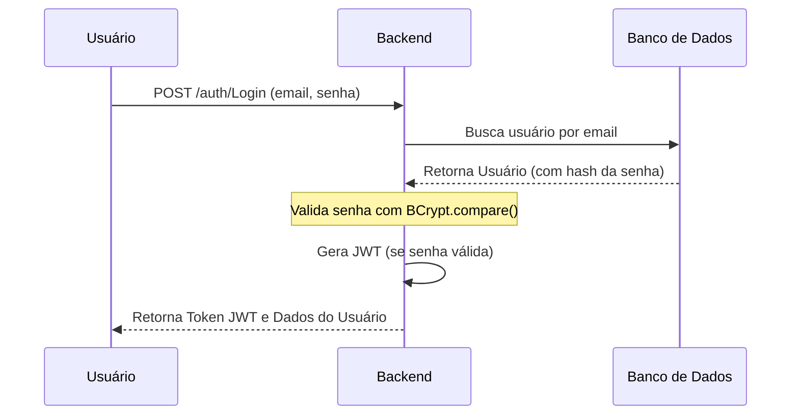

# Backend Architecture (Arquitetura do Backend)

O projeto utiliza o padrão **MVC Simplificado** (Model-View-Controller) focado em separação de responsabilidades.

---

## 1. Stack Tecnológica
- **Runtime:** Node,js.
- **Framework:** Express.
- **Linguagem:** TypeScript (ou JavaScript).
- **Banco de Dados:** PostgreSQL.
- **Autenticação:** JWT (JASON Web Token).
- **Criptografia:** BCrypt.

## 2. Estrutura de Pastas (src/)
- `/routes`: Definição dos caminhos da API.
- `/controllers`: Lógica derecebimento de requisições e resposta ao Front- end.
- `/services`: Regras de negócio e comunicação direta com o banco.
- `/models`: Definição dos esquemas de dados.
- `/middlewares`: Filtros de segurança (ex: verificar se está Logado).

## Fluxos de processos (Diagramas)

### 1. Fluxo de Autenticação (Segurança)

Garante que o acesso seja restrito e os dados protegidos por JWT.



### 2. Fluxo de Fechamento de Mês (Lógica do Histórico)

O processo que "tira a foto" das finanças para alimentar os gráficos de 3, 6 e 12 meses.

```mermaid
flowchart LR
    A[Fim do Mês] --> B[Soma Receitas/Despesas]
    B --> C[Busca Saldo de Investimentos]
    C --> D[Gera Snapshot da Monthly_History]
    D --> E[Libera Dashboard para Novo Mês]